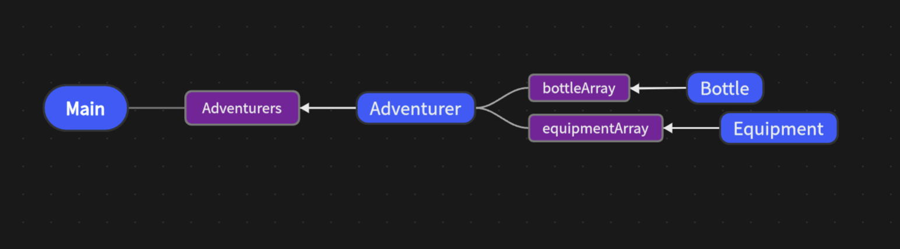
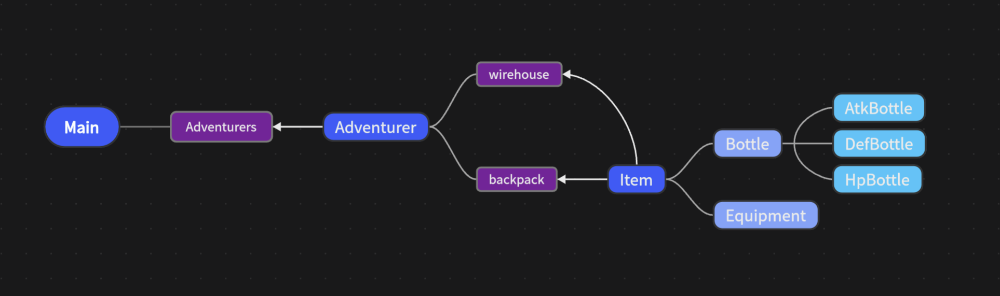
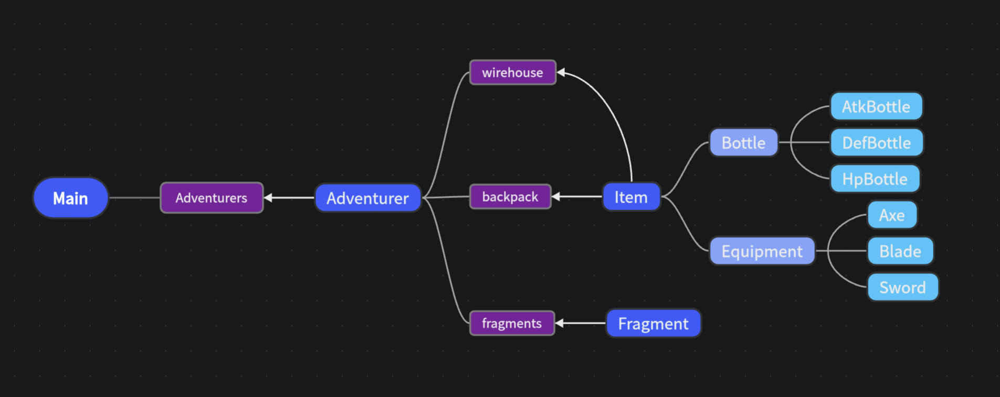
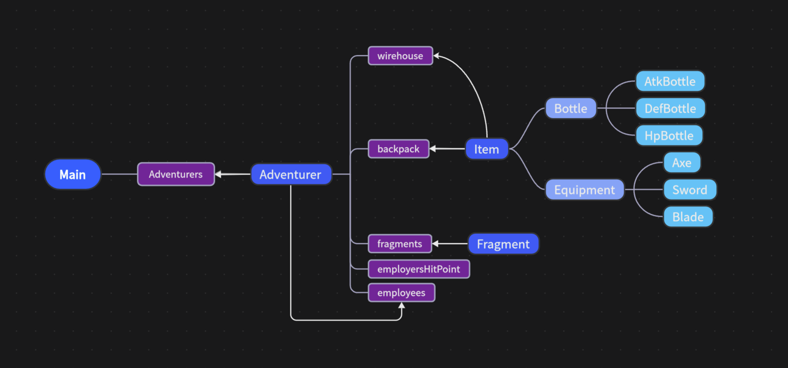

# BUAA Object-Oriented Pre Summary
## 主要内容
OOPre课程完成了简单的冒险者游戏，课程组带领我进入了面向对象的编程世界
## 架构设计
+ **第一次迭代：**  

+ **第二次迭代：**  

+ **第三次迭代：**  

+ **最终架构：**  

+ **架构调整及考虑：**  
第一次迭代时容器以arraylist实现，分别存储bottle、equipment  
第二次迭代增加**携带、使用物品功能**，新建**父类Item**，统一管理Bottle和Equipment，同时，为方便容器查找删除操作，**将容器修改为hashmap**，创建可携带物品的容器backpack  
第三次迭代增加**碎片及战斗功能**，新建**Fragment**类  
第四次迭代增加**雇佣和副本功能**，增加容器employees记录被雇佣者，增加容器employersHitPoint记录雇主的 id & hitPoint  
**反思：** 最终迭代完成后的架构仍存在许多问题，以下列举个人认为问题比较大的三条：  
  1. 最后一次迭代中未能实现观察者模式与工厂模式
  2. 实现雇佣功能时代码结构混乱，不够清晰 
  3. 整体封装做的较差，许多函数实现会将private属性调出后做处理
## JUnit心得体会
JUnit可以通过编写单元测试，进行各单元的独立检查，使用assert自动化检测发现代码中的问题。  
本人最初习惯于编写全部代码通过测试后再编写JUnit，~~仅仅为完成覆盖率任务~~，使JUnit测试失去了应有的作用。  
经过oopre课程，总结出几个提高JUnit测试效果的注意点  
1. 构建测试数据需要注意边界条件
2. if_else, case等具有分支的条件判断语句，需要测试全部分支
3. 单元测试应独立化，简洁化，一个测试单元只测试一个单一功能，避免代码间的过度依赖
## OOPre学习心得体会
从面向过程编程过渡到面向对象编程总的来说还是一个略显困难过程，对c语言的熟悉和对java语言的完全不了解使得课程起始时过的异常艰难，甚至第一节课过后非常迷茫、崩溃，但经过大量CSDN文章阅读和第一次课下作业之后，慢慢开始能独立实现java程序。感谢OOPre课程，让我体验到了完全从零开始认识、初步学会一门编程语言的成就感，~~真的完全无法想象直接进入OO课程会多么痛苦~~。整个课程中的八次课程、四次迭代、三次改错作业真的让我发现了面向对象编程在项目实现中的优越性，无论是对类的封装、继承和接口带来的可重用性、还是封装后的可拓展性，都让一个巨大的编程项目可以做到解耦，由多人合作实现，也给代码维护带来了巨大的便利。面向对象编程的这种独立性，灵活性，可拓展性完全是面向过程编程无法比拟的。OOPre课程中对JUnit、git的使用，也为我们之后的OO正课学习，甚至是之后参与超大型项目的实现，打下了一定的基础。  
## 对OOPre课程的建议
第一次课程的讲解有没有可能让没接触过java语言的同学，入门稍微轻松一些  
其他方面OOPre课程真的非常好，感激OO课程组！！！！