# BUAA Object-Oriented Unit1 Summary
## 前言
本单元主要任务为表达式化简，完成括号展开。第一次作业实现 $a*X^b$ 形式的表达式括号展开，第二次作业增加了三角函数与自定义递归函数并允许括号嵌套，第三次作业又增加了求导功能和普通自定义函数，三次作业根据递归下降的方法，不断迭代，逐层深入，难度逐渐增加。
## Iteration1
### 架构分析
第一次作业为实现含幂函数与常数的表达式括号展开与化简，UML类图如下
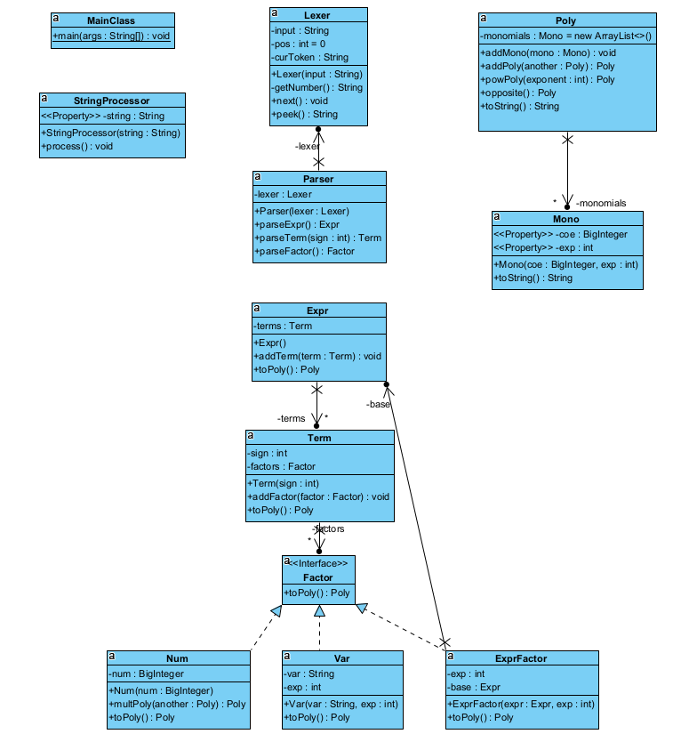
+ MainClass：程序入口
+ StringProcessor：字符串预处理，减少字符串不必要符号且去除所有空白符  
+ Lexer：词法分析  
+ Parser：语法分析  
+ Expr：表达式 
  + Term：项
    + Factor：接口，因子 
      + Num：常数因子
      + Var：幂函数因子
      + ExprFactor：表达式因子
+ Mono：单项式，转化为a*x^b形式
+ Poly：多项式，将表达式转化为多项式合并化简输出
### 度量及优化
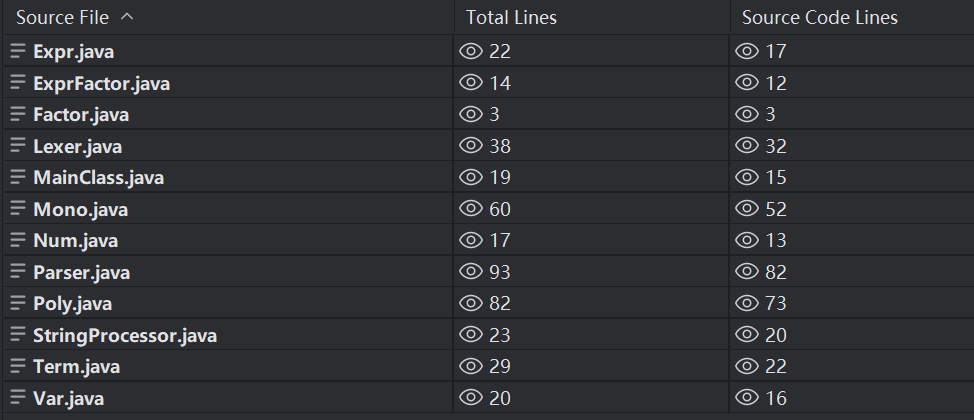
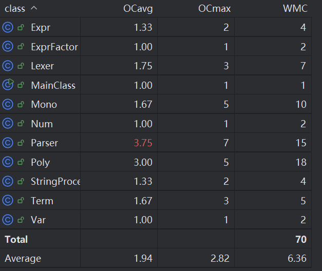

本次作业对类的长度和复杂度控制整体比较不错，但仍存在复杂度超标的情况。  
Parser类中未对Parser.parseFactor()方法解耦，不同类型的因子解析全在Parser.parseFactor()中直接进行  
优化方式：Parser.parseFactor()只进行判断因子类型的工作，将具体解析因子的工作交给其他方法，如Parser.parseNum()， Parser.parseVar(), Parser.parseExprFactor() 

## Iteration2
### 架构分析
第二次作业在第一次作业的基础上增加了三角函数，与自定义递推函数，并且支持括号嵌套，UML类图如下  
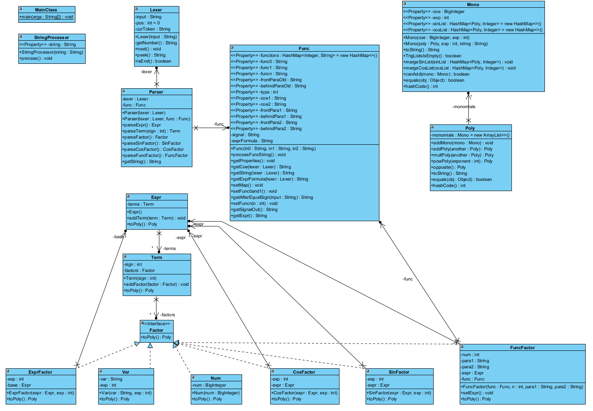

+ SinFactor：正弦因子
+ CosFactor：余弦因子
+ Func：函数预处理，接收自定义递推函数并解析，使递推函数可在表达式中调用
+ FuncFactor：函数因子，根据函数预处理结果，将输入函数转化为表达式
+ 其余结构与hw1相同

ps：括号嵌套无需特殊处理，采用递归下降方式自然解决！！
### 度量及优化
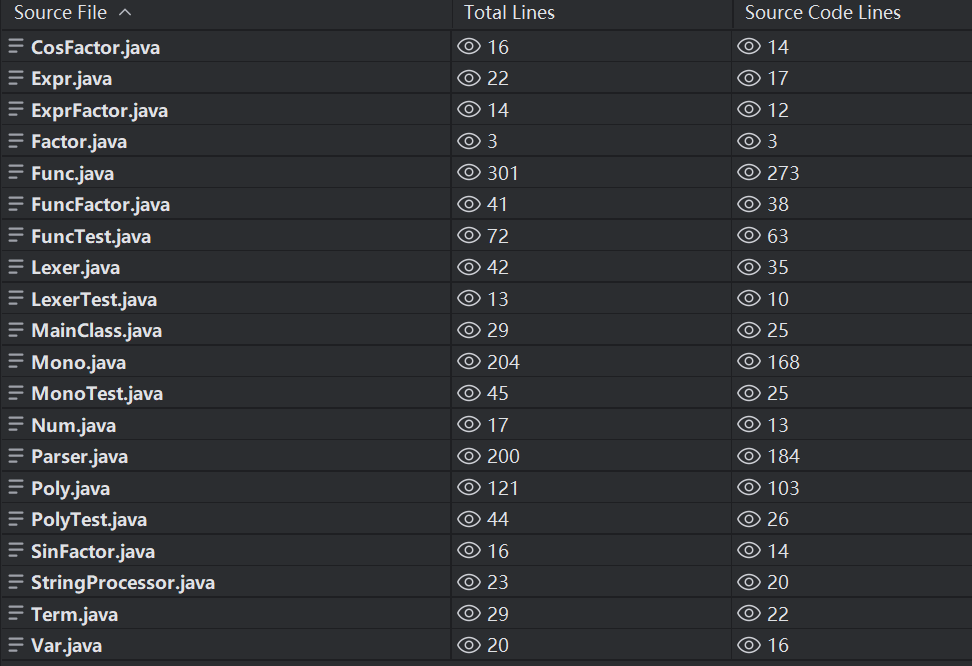
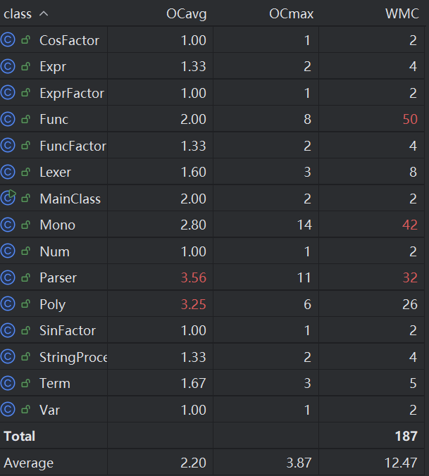  
本次作业中因为增加了三个因子类，单项式形式变得更加复杂，Mono类行数与WMC（加权方法复杂度）显著提升, Mono.toString()方法复杂度严重超标  
新增加的Func类中对自定义递推函数的处理十分繁琐，类行数与WMC都非常高，不利于之后维护  
优化方法：合并Mono.toSting()方法中的公共逻辑，减少分支，并将一些功能拆分另写其他方法处理；  
将Func类功能进一步拆分成其他小类，具体解析函数工作交予其他类处理，Func类只做最终的函数储存与调用

## Iteration3
### 架构分析
第三次作业又在第二次作业的基础上增加了求导功能和普通自定义函数，在前两次作业的基础上迭代本次作业实现较为容易，但也是导致最终代码结构混乱的“罪魁祸首”，UML类图如下  
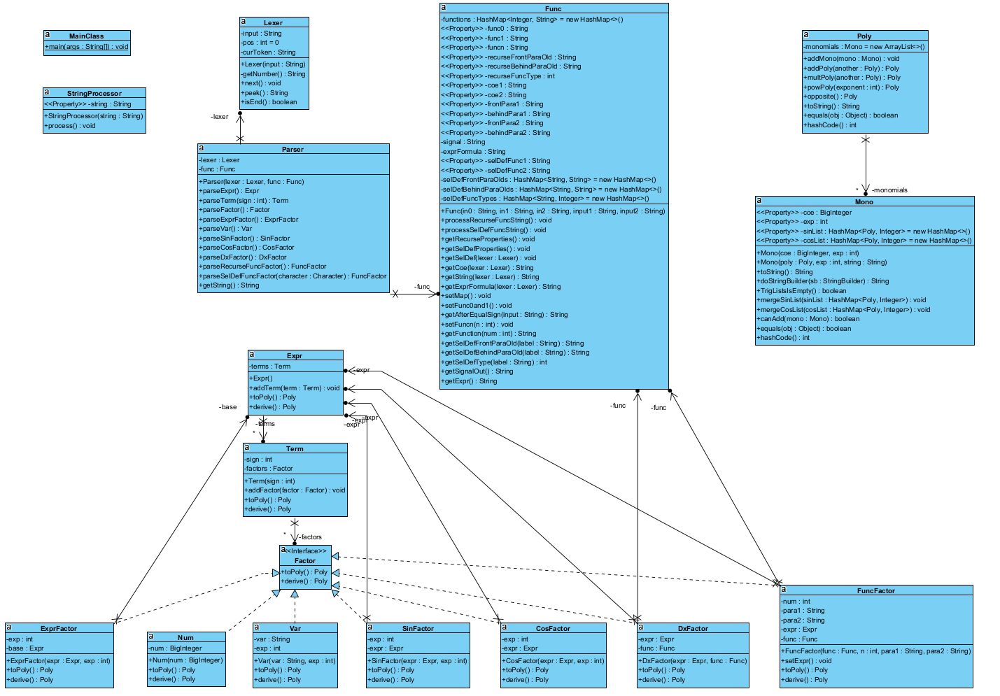

+ DxFactor：求导因子
+ 其余结构与hw2相同

本次作业求导采用在各个类中分别求导的方式，将不同类的对象通过derive()方法求导并转化为Poly对象  
优点：每个类中的derive()方法简单，易实现，可读性高  
缺点：由于未实现Poly的derive()方法，遇到dx(dx())的情况时，需要将DxFactor.derive()的Poly对象转化为String重新进行词法语法解析，将其变为表达式重新解析，导致代码结构混乱，封装性差  

普通自定义函数功能合并到Func类中，与自定义递推函数类似实现解析
### 度量及优化  
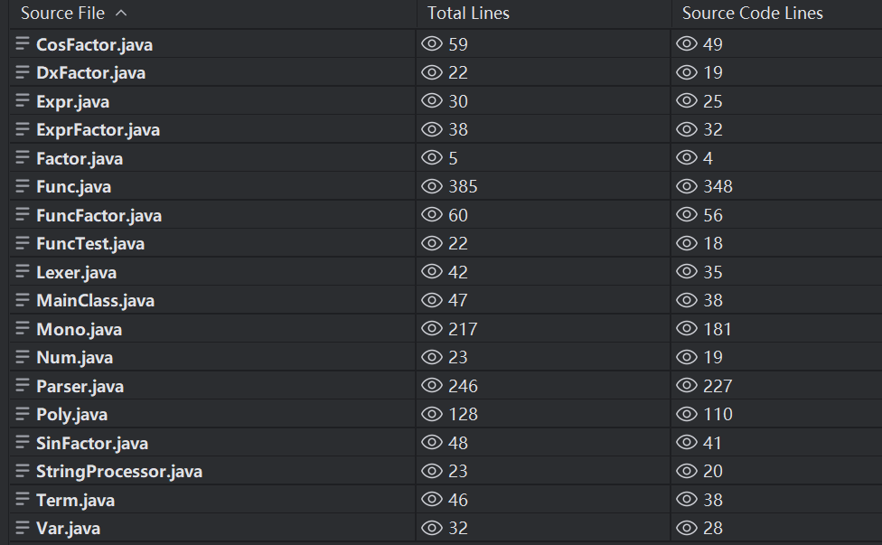
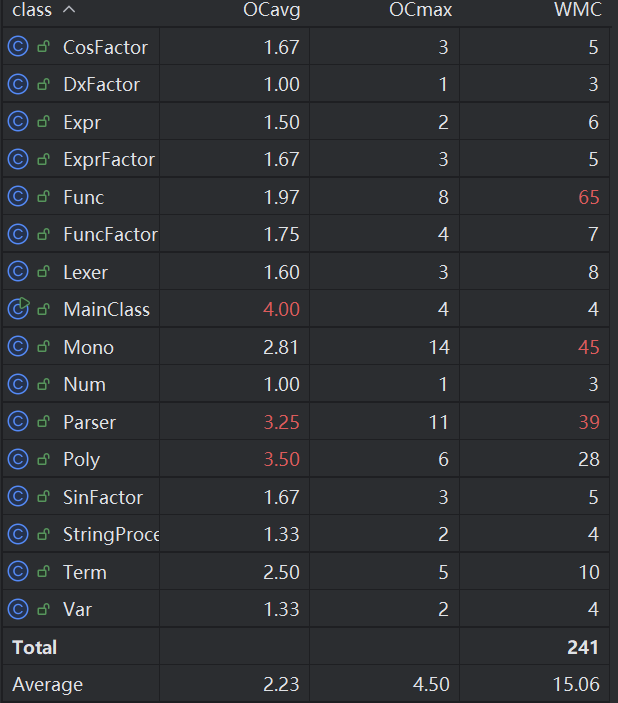
本次作业中输出形式复杂，由于没有专门的输入处理类，MainClass类进行了过多输入处理操作，OCavg（平均操作复杂度）过高  
新增的普通自定义函数处理合并到Func类中，Func类的WMC（加权方法复杂度）超标更加严重  
优化方式：增加输入处理类，专门处进行输入处理，MainClass只作为程序入口，进行IPO模式调用；  
在hw2优化Func类的基础上，新建普通自定义函数处理类，与hw2自定义递归函数处理可使用同一个接口或继承同一个父类进行操作，Func类仍然只做最终两种自定义函数的合并储存与调用  

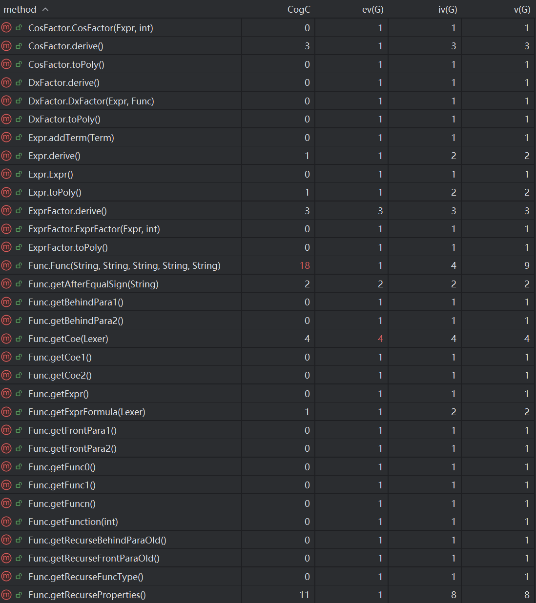 
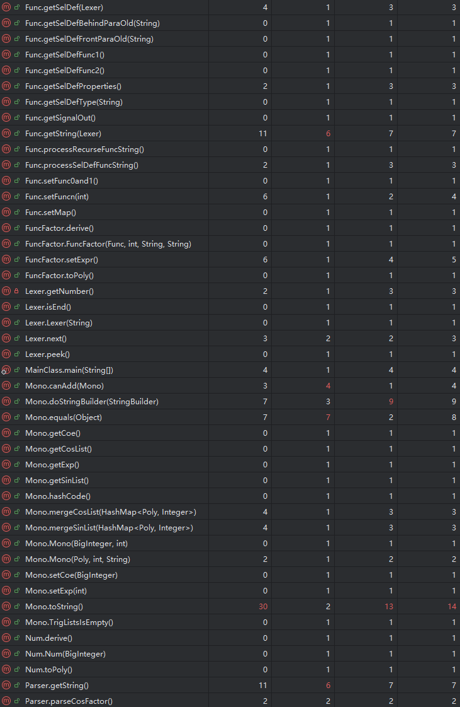 
三次迭代后整体方法的复杂度和可读性都较为优越，个别方法过于复杂如上述提到的Mono.toString(),Parser.parseFactor()等，也可以通过拆分成小功能方法进行优化处理

## bug分析
第一次作业  
在Poly.multPoly()方法中每次乘法后没有利用Poly.addPoly()合并同类项，导致强测爆出MLE  

第二次作业  
第二次作业中bug较为严重，强测成绩也非常惨淡  
  + 双变量函数替换时直接进行字符串替换，导致第二次替换变量可能会替换第一次替换后的变量，如f{0}(y,x) = y-x，计算f{0}(x,x\^2),错误结果为0，正确结果应为x-x^2  
  + 对第一次作业中语法分析的重载，仅仅修改了双变量函数的Parser，未向单变量函数的Parser中传入Func，导致若单变量函数的参数为函数则会出现报错  

本次作业结束后，深刻认识到课下自我评测的重要性，即使中测过了也需要进行充分的数据测试，才能保证强测成绩  

第三次作业  
根据第二次作业的经验，第三次作业在课下利用评测机进行了充分的测试，解决了代码存在的问题，全绿通过强测，但性能分被大佬们爆烂了（哭哭）
## hack策略
1. 边界数据测试，使用0,sin(0),cos(0)等边界数据进行测试
2. 利用自己代码的问题测试，共性问题中刀概率非常大
3. 自动生成测试数据，利用评测机进行代码测试
## 优化
本人在Poly和Mono中重写了equals()和hashcode()方法，还在Mono中增加了canAdd()方法，为作业二及作业三中复杂形式的Mono比较，以及之后的合并同类项提供基础
## 心得体会
1. **理清思路后再下手** 完成一次作业前要充分阅读指导书，明确作业目的后先对代码结构构思，完成基本思路后再下手，避免在作业完成中出现不可解决的问题而需要重构
2. **要敢于重构** 如果发现代码结构实在混乱，无法清晰完成必要任务，一定要有重构的勇气和决心。重构的过程是痛苦的，但结果会是美妙的
3. **要做好本地测试** 一定要在强测前对自己的代码进行充分的本地测试，始终抱着怀疑态度，不能轻易相信自己的代码没有问题，只有这样才能在强测中获得令自己满意的成绩
## 未来方向
第一单元课程设置比较合理，祝愿oo课程无限进步