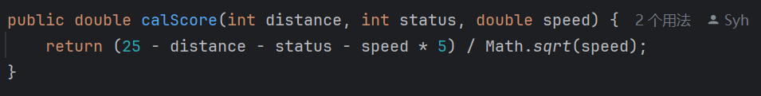
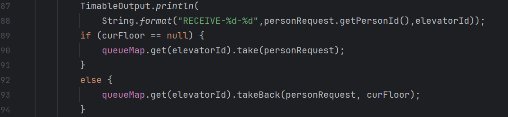

# BUAA Object-Oriented Unit2 Summary
## 前言
本单元主要任务为多线程电梯设计。第一次作业实现为乘客分配固定电梯的简单运行模式，第二次作业去除了固定电梯，需要设计调度器为乘客灵活分配电梯，同时增加了临时调度Sche，Receive输出两个要求，第三次作业又增加了双轿厢改造Update要求。三次作业难度梯度增加，多线程编程设计的地狱级挑战。
## 架构设计
### Iteration1
乘客分配固定的简单运行电梯，本次作业OO课程是对多线程编程实现的入门，结合生产者-消费者模式实现电梯运行  

输入线程InputThread将请求储存到总请求队列RequestQue中，调度器RequestScheduler将RequestQue中的请求不断分配给要求电梯的PassengerQue，电梯线程Elevator根据电梯策略类Strategy不断分析乘客请求队列PassengerQue进行电梯运行  
笔者在本次作业中实现了两组生产者-消费者模式，“InputThread(生产者)——RequestQue(托盘)——RequestScheduler(消费者)”，“RequestQue(生产者)——PassengerQue(托盘)——Elevator(消费者)“，两组生产者-消费者合作完成电梯根据请求运行的作业要求  
值得一提的是，作业中的电梯线程只是傻瓜电梯，根据Strategy返回的Advice状态直接完成操作，完全不对自己的等待队列进行分析。指导书中提出的这种设计方式，将复杂的电梯线程分解成策略类Strategy和操作类Elevator，两者间只通过Advice状态进行交流，这样的解耦使代码逻辑清晰，编程难度大大降低。  
当通过课上讲解与实验上机初步理解多线程的实现方式后，本次作业的难点其实就在电梯策略类的实现方式上。笔者阅读了大量往年学长学姐的博客，最后还是选择了LOOK策略，相比往年的题目，今年增加的优先级并未被笔者考虑到LOOK策略中，只是在电梯的PassengerQue中设计优先队列PriorityQue，让优先级高的乘客先行进入电梯，幸运的是笔者在第一次作业强测中还是拿到了96.3分（LOOK大法好！！）

### Iteration2
第二次作业中乘客不再有固定的电梯，需要设计调度器灵活为乘客分配电梯，同时增加了临时调度Sche与输出Receive的要求  

本次作业相对于第一次作业并未做整体线程结构上的大修改，只是增加了返回请求类BackRequest，并在RequestQue中增加了backRequests和scheRequests两个储存不同请求的容器，Sequence Diagram相比于第一次作业没有变化  
作为本单元最复杂，甚至是整个OO课程最困难的一次作业，主要难点有四点：  
1. 临时调度请求的实现
2. 退回请求的处理
3. 调度器结束条件的修改
4. 请求调度器的策略实现

**临时调度请求**：笔者将临时调度Sche作为电梯的一个状态加入Advice中，调度器优先为电梯提供临时调度请求并记录电梯号不再让电梯receive请求，电梯进入临时调度状态，完成临时调度操作后电梯线程Elevator通知调度器线程RequestScheduler可以重新接受乘客请求  
**返回请求的处理**：此难点与临时调度息息相关，当出现临时调度时则会出现实现PassengerQue向调度器RequestScheduler退回请求的问题。为了处理返回请求，笔者新增BackRequest类解决“out-F”需要修改乘客fromFloor的问题，并在总请求中新建backRequests队列，电梯线程Elevator直接将需要返回的请求全部以BackRequest形式退回总请求队列RequestQue。又考虑到不让退回请求被“饿死”，影响性能分，同时来的backRequest和新增personRequest，调度器优先分配退回请求backRequest。笔者最初将backRequests设在调度器RequestScheduler中，导致调度器从总请求队列中取请求时，若总请求队列为空会进入wait状态，之后如果不再有请求input，调度器发生死锁，无法再分配退回请求。低耦合性非常重要，明确每个类的职责，将backRequests放到总请求队列才是正确的设计！  
**调度器结束条件的修改**:此难点是笔者本次作业中出现的最大问题，导致了作业当中的重构。总请求队列中需要记录到达的乘客人数，当输入结束且所有请客全部结束后，调度器线程才能结束，否则如果输入结束总请求队列为空调度器结束后，如果再有退回请求，调度器将无法再次处理。
**请求调度器的策略实现**：笔者构建电梯score计算方法，仿影子电梯对每个电梯计算分数，分数高者获得请求，具体将在之后的**调度器设置**部分进行阐述。  

### Iteration3
第三次作业增加双轿厢更改要求  

本次作业中笔者增加子线程UpdateThread专门用于处理update请求，保证多个update请求到来可以同时处理且不影响主请求调度器，RequestScheduler不需要sleep
## 同步块设置与锁的选择
1. RequestQue，PassengerQue两个托盘类所有方法加锁，保证生产者-消费者模式中不出现冲突问题
2. priorityQue： 从PassengerQue类里取出非线程安全的priorityQue队列，对其synchonized，避免出现遍历队列时修改ConcurrentModificationException报错  
图片
3. 电梯线程Elevator调用调度器RequestScheduler方法时需要加锁，避免调度器运行时修改  

## 调度器设置
参考plh学长博客,设计伪影子电梯评价函数方式  

根据电梯的容量，电梯内人数，电梯等待人数计算电梯status值，再计算电梯从现楼层到目标楼层且方向相同的距离  
将请求分配给得分高的电梯，若相等则随机分配

## 双轿厢
### 双轿厢同步开始改造
子调度器UpdateScheduler向两部电梯发信号，两个电梯分别完成目前操作后进入update状态，放出电梯内所有人后，电梯向子调度器传递信号可以开始改造，当电梯AB信号都已到达子调度器，子调度器开始改造双轿厢电梯
### 双轿厢不碰撞
设计TrandferFloor共享类，当一个电梯能到达获取锁，另一个电梯则无法进入开始wait，位于共享层的电梯运行结束自动释放锁，notify等待电梯，等待电梯即可进入共享层

## 多线程debug
1. synchonized(priorityQue)问题：  调出priorityQue后对其加锁后才能进行遍历操作
2. 调度器结束条件：当到达人数等于personRequest人数且input结束时，调度器才能结束
3. 输出顺序问题：评测的主要bug都出现在有关Receive输出与操作的先后顺序上！！评测机根据时间戳进行评测，如果输出与操作顺序出错的话，经常会出现等待时间不够，在sche状态进行receive，move等问题。    

''一定要先完成receive输出，再让电梯获得请求！！''  

''先输出sche begin在退回请求''  

1. “围师必阙”问题：当5个电梯同时处于临时状态且来很大数量的请求时，所有请求将由唯一电梯接受，可能会导致RTLE。设置电梯等待队列人数最大数量为15，当等待队列人数已满时，再来的请求将会已backRequest的形式回到主请求队列

## 心得体会
多线程设计中线程安全是非常重要的一部分，需要注意不同线程间的逻辑关系，对共享对象一定要加锁！！而在层次化设计中，要对整体先有构思，将并发任务解耦，各层独立完成，下层可微上层服务。同时尽量要让自己的程序有更多的可拓展性  
After all，电梯月终于结束了(撒花)