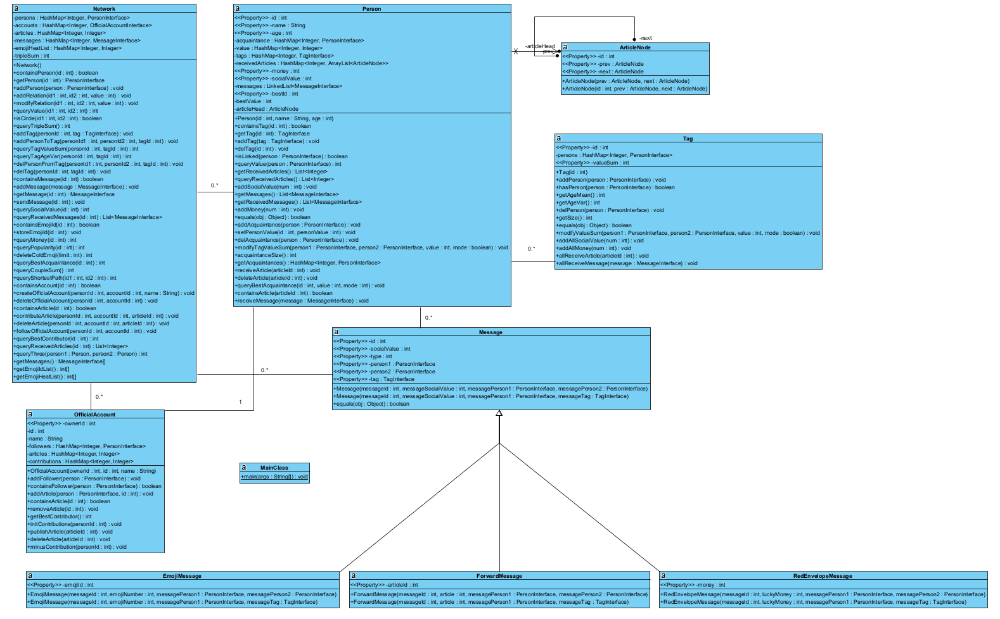

# BUAA Object-Oriented Unit3 Summary
## 前言
本单元主要任务为理解，学习阅读，简单编写代码的JML规格，并根据JML规格完成方法的JUnit的测试。实际任务为社交网络程序的编写，三次作业都是在课程组编写的JML基础上，实现代码。经过本单元的训练，笔者充分体会到了JML的优势与复杂性，拓宽了重要关键软件编程相关方面的视野。
## 测试分析
### 单元测试
单元测试是软件开发过程中的一个重要环节，它涉及对软件中最小可测试单元的检查和验证。在我们面向对象使用的Java语言中，这通常是对单个类或方法的测试。我们使用JUnit进行单元测试，目的是确保代码片段的行为与我们的预期相符，并符合JML规格。这样的测试可以帮助开发者在早期阶段就测试出错误，对于耦合性低，模块化的代码，单元测试可以起到很重要的作用。
### 功能测试
功能测试验证软件单个功能是否符合业务需求。在我们的作业实现中，功能测试是测试方法能否正确完成任务，拿deleteColdEmoji方法测试举例，测试者需要保证其正确完成删除EmojiMessage的任务。
### 集成测试
集成测试在单元测试之后进行，对多个模块或服务之间的交互正确性进行测试，目的是保证项目整体的各个模块可以正确地协同合作。集成测试关注模块间的交互，仍用deleteColdEmoji方法测试举例，集成测试保证其删除coldEmoji实现不对Network,Person,Tag的协作关联产生冲突及负面影响。
### 压力测试
压力测试是通过模拟大量、超出软件规定的负荷或者测试环境进行测试，以确定其性能的稳定性和可靠性。目的是调整优化系统的性能，以便在高负载环境下正常工作。在deleteColdEmoji测试中，笔者通过随机生成至少15个点，200条边，500条Message的社交网络构建压力测试，避免测试数据过弱无法测出程序错误。通过这种测试，可以发现系统的薄弱环节，确保在正常工作条件下系统不会因为过载而崩溃。
### 回归测试
回归测试是在软件发生功能更新、bug修复、性能优化等更改后进行的测试，以确保这些对程序的修改没有引入新的错误，也没有影响到现有功能。回归测试确保软件在修改后仍能按预期工作。
### 数据构造策略
1. 多样性生成：
   节点：生成50-200个唯一节点，覆盖不同规模。
    边：生成无重复、无自环的有效边，确保图的连通性。
    消息：混合EmojiMessage、ForwardMessage、RedEnvelopeMessage，覆盖发送和未发送状态。
2. 随机性：
    使用Random类生成随机节点、边权重、消息ID和热度。
    模拟不同输入组合，暴露潜在边界问题（如零热度、重复ID）。
3. 参数化测试：
    通过@Parameterized运行器生成多组测试数据，提高覆盖率。
    每组数据独立运行，避免测试间的状态污染。
4. 状态拷贝：
    copyNetwork方法复制原始网络，用于操作前后的状态对比。
    确保测试结果仅由被测方法引起，排除外部干扰。
5. 边界覆盖：
    生成空图等边界数据、覆盖不同limit值（如0、极大值），验证过滤逻辑的鲁棒性。

## 大模型辅助设计
大模型可以完成简单方法由JML规格编写java代码，但代码仍可能存在部分问题，在复杂任务设计中，需要使用分段式设计的方式帮助大模型完成任务。  
分段式设计：将JML设计与代码实现拆解为需求分析、规格建模、代码生成、验证与优化等阶段，为每个阶段设计针对性提示模板。例如，在需求分析阶段，通过结构化自然语言描述前置条件、后置条件，引导大模型生成初步JML片段；在验证阶段，结合模型生成的测试用例与JML规范进行自动化验证
## 架构设计

本单元由于JML规格化描述已经由课程组完成，架构设计并不是难点

图模型构建network中储存persons（点），每个person中储存自己的关系（边），查询连通点使用bfs算法  
较为特殊的数据结构，笔者在构建Person.receivedArticles数据结构，利用hashmap实现双向链表结构，使链表删除与查询时间复杂度从O(n)降低至O(1)
## bug修复
### 性能问题及修复
本单元第一次作业中，queryTripleSum方法笔者使用邻接矩阵计算三元环，时间复杂度为O(m*n^2)，性能问题导致强测出现CTLE。  
修正：动态维护tripleSum 信息，加边时，考虑新边的两个端点，新增的 tripleSum 数量即是两个端点的邻居集合的交集，删边的时候同理。这样queryTripleSum的时间复杂度降到了O(1)，虽然加边与删边的时间复杂度变为O(n)，但把时间复杂度平摊了到多个操作中，这样的优化是可接受的。  

在后续的作业中汲取了错误经验，对queryTagValueSum，queryBestAcquaintance等方法均使用动态维护，保证单个方法时间复杂度均在O(n*logn)以下，没再在强测中出现过性能问题。
### 规格与实现分离
规格与设计分离指在软件开发过程中，我们可以分别独立地描述软件的“什么”和“如何”。即，我们将软件的功能需求或业务逻辑（即规格）与软件的实现细节或内部结构（即设计）分离开。  
主要思想：  
1. 规格（或需求）描述了软件应该做什么，也就是它需要提供哪些功能，如何满足用户的需求。
2. 设计则描述了如何实现这些功能，包括软件的结构，类或函数的设计，选择何种算法等实现细节。

核心价值：  
1. 降低耦合：规格作为抽象契约，独立于具体实现，允许在不影响外部行为的情况下优化内部逻辑。
2. 增强可验证性：通过形式化规格（如JML）自动验证代码是否满足设计要求。
3. 促进团队协作：开发团队基于规格并行开发，测试团队可直接依据规格设计用例，减少沟通成本。
## Junit测试
笔者认为JUnit测试构建主要分两部分：数据生成与方法测试
1. 数据生成：
在本单元作业中，笔者编写generateUniqueNodes方法生成点（person），generateValidEdges生成边（relation），generateType0/1Message生成不同类型消息，并据此createNetwork生成网络。  
数据生成基本上使用随机生成，保证数据强度，并加以考虑边界条件，保证数据生成的全面性。
2. 方法测试
JML和Junit具有描述软件如何运行的一致性，这非常适合我们利用JML设计Junit测试。JML是方法的预期行为，我们根据JML的@requires @ensures @invariant等对方法的约束条件，与@assignable \result等对结束状态的要求，将规定的预期状态与方法操作后的实际状态进行对比，编写JUnit测试。  
更进一步，我们可以利用大模型根据JML直接生成@Test测试代码，对方法进行测试验证程序是否符合JML规格要求，有效地提高了代码质量的保证和验证效率。

## 心得体会
相比前两单元，仅考虑作业完成难度本单元较为容易。本单元作业中完成难点主要在方法实现的优化与基于JML规格的JUnit测试编写，对JML理解及简单编写并没有在作业中充分体现。  
本单元的课程更接近实际生产中的需求——实现——测试的流程，让笔者对代码设计开发有了较全面的了解，对以后的程序设计开发更加感兴趣了。  
本单元的课程也让笔者对JML规格的应用性产生了部分深思，在作业较为简单的情况下，如sendMessage方法的JML规格就已经初具规模，阅读理解都有一定难度，在之后的生产开发中应对更复杂的程序，JML规格的编写难度急剧上升，可读性大大下降，也为实现带来了较大的困难，所以JML规格究竟适合应用在多么关键，多么复杂的程序中呢，笔者不禁陷入思考……