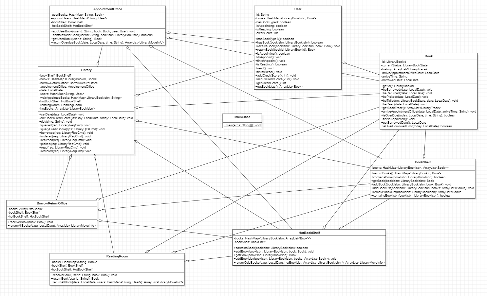
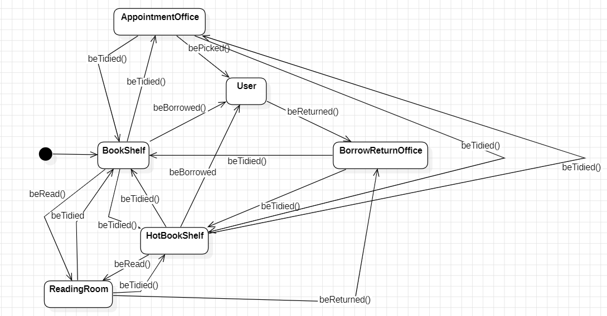

# BUAA Object-Oriented Unit4 Summary
## 正向建模与开发
面向对象编程理想的正向建模大概分为5步：
1. **需求分析**：在本单元中便是搞懂指导书中的内容，将需求整理出来，形成需求文档
2. **概念类图建模**：从需求文档中提取出关键概念，形成类，主要关注类、属性以及类与类之间的关系，不关注类中的方法
3. **系统行为建模**：绘制状态图、顺序图等，描述对象之间如何协作来实现需求文档中所要求的功能
4. **设计建模**：根据状态图、顺序图中分配给类的职责，向类图中添加详细的方法，并精化关联、聚合/组合、继承、接口等关系，形成最终的设计类图
5. **代码实现**：根据完成的类图实现代码，并进行系统测试，验证是否满足需求文档中的需求

很遗憾，笔者在本单元的三次作业中，并没有实现完全的正向建模，当感受到UML类图与代码之间相互修改的巨大困难后，便“落荒而逃”了。不过，笔者的确认为，在真正的大规模工程团队协作中，正向建模是高效的也是必要的。在对需求文档理解透彻的情况下，正向建模可以大大加快代码实现的速度，并极大地避免了多人编程混乱不清的问题。
## 架构设计
### 类图
三次作业完成后的类图如下

Library：图书馆，储存所有书籍，储存所有出现的用户，分发处理输入请求，输出操作结果
BookShelf：普通书架，储存在架一般书籍
HotBookShelf：热门书架，储存在架热门书籍
BorrowReturnOffice：借还处，接受退还书籍，并等待整理书籍进入书架
AppointmentOffice：预约处，储存被预约书籍，等待用户领取
ReadingRoom：阅览室，储存被阅读书籍
User：用户，储存被用户借阅的书籍
Book：书籍，记录书籍自身的移动信息
### 状态图

书籍在BookShelf,HotBookShelf,AppointmentOffice,BorrowReturnOffice,ReadingRoom,User在各种操作下，在六个状态间互相转换。
### 代码与UML模型设计之间的追踪关系
1. **类图 & 代码**：整体类图设计与代码基本对应，每个类的所有属性、方法都在类图中有相应体现，类图中也明确反映了各个类之间的关联与聚合关系。
2. **状态图 & 代码**：由Book类中beBorrowed,bePicked,beRead,beReturned,beTidied五个方法，明确了书籍的所处位置转移，与状态图中的Trigger一一对应。
3. **顺序图 & 代码**：颇为遗憾，笔者实现的简单借书流程顺序图，只做到message传递与代码中简单对应，并没有完善地描述出真实清晰的message传递流程。
## 大模型辅助架构设计
经过两次有关大模型的上机实验再结合平常完成OO课程作业的体验，笔者总结出一套大模型辅助面向对象编程架构设计的基本流程
1. **分解复杂场景**：使用大模型前我们先将整个复杂场景进行简单分解，将大型问题分解成可以管理的子任务
2. **任务需求提取**：将分解后的子任务与原场景提供给大模型，命令大模型提取出我们设计所需的需求文档（主要根据子任务生成需求文档，原场景作为补充对照，避免人工分解中产生的纰漏）。
3. **类的抽象**：根据需求文档命令大模型抽象出基本的类与类的属性
4. **反思提炼**：命令大模型根据需求文档对上一步的输出从准确性、完整性、必要性三个方面进行反思打磨，提高抽象的准确率，并从中提炼出类图格式的具体类
5. **关系提取**：命令大模型回顾上一步骤的输出，并采取思维链自我反思的方法提取出各个类间的关系
6. **行为精炼**：从之前分解的子任务中提炼出关键功能，并命令大模型根据已经完善的类图，完成关键功能的顺序图
7. **人工检查**：最后一步，我们还需要人工对大模型的输出进行检查修正，确保大模型生成的架构设计紧紧贴合场景需求

根据此套步骤我们可以成功由问题场景借助大模型完成基本的架构设计，类图与关键功能的顺序图均已完成，之后我们便可以据此继续编程的工作。
## 架构设计思维的演进
1. **OOPre**：完成oopre课程后，笔者对面向对象编程的设计思维有了比较浅层的了解，虽是一直在尽量向面向对象编程的设计方向靠拢，但整体的设计还是很具有面向过程的风格。
2. **Unit1**：第一单元课程中，随着表达式解析的逐渐实现，对递归下降方法的理解逐渐透彻，笔者更加体会到了面向对象编程解耦，封装的巨大优势。也是在本单元中，笔者真切感受到了上来直接写代码的巨大劣势，从此笔者开始在OO作业中习惯先提取指导书中的需求，完成大概的设计文档，建立基础的类与功能方法，再开始写代码。这样把梳理清晰需求任务的工作放在编程之前的做法，让我在之后OO课程中很少进行重构，代码的实现也变得效率了许多。
3. **Unit2**：到了第二单元多线程电梯，设计的主体转到了多线程间的协同工作。本单元让我的编程设计意识从单线程拓展到了多线程任务的并发与互斥。“生产者-消费者“模式、单例模式、工厂模式等多种设计模式的学习，也让我明确了保证线程安全的多线程任务设计思维。
4. **Unit3**：第三单元中学习了JML语法及其使用方法，本单元作业中的架构设计基本被课程组提供的JML规格所限制，思维从功能设计转向通过架构设计，利用动态维护等方式选择最合适的算法，在保证正确性、可读性的前提下提升方法实现的性能。
5. **Unit4**：第四单元主要体会了面向对象编程中正向建模的架构设计，通过UML我们可以在写代码之前就通过类图、状态图、顺序图等对需求进行全方面的解析，在优秀的正向建模设计下，可以大大降低后续代码编写出错的可能，使得设计过程更加的完备、清晰。

总的来说，经过整个OO课程的训练，笔者对面向对象编程的设计思维有了更清晰的认知。而笔者在第一单元积累的写代码之前完成需求分析的经验，与第四单元UML正向建模的过程极为相似，也是让笔者深刻认识到了优秀设计思维为整个编程过程带来的巨大优势。
## 测试思维的演进
1. **OOPre**：在OOPre课程中开始了解到JUnit单元测试，使用其对代码进行简单测试，但由于OOPre课程作业相对简单，JUnit测试也显得无关紧要，笔者也一直没有对代码的测试 部分重视起来
2. **Unit1**：第一单元课程中笔者开始意识到测试的重要性，从第一次作业简单手搓数据强测爆炸，到之后开始接触评测机，包括自己编写评测机，强测前充分测试，测试的重要性逐渐凸显。但此时对第一单元表达式结果的正确性只是着重在结果的对错，并没有完全符合课程组要求输出的格式正确性，导致第二次作业的强侧成绩也颇为惨淡。由此，我也意识到了测试不仅是结果的正确性测试，也要注意对输出等各项要求的全面性测试。
3. **Unit2**：第二单元中，作为多线程电梯单元在测试方面真的是非常不友好，可能随机出现的死锁，很多不可复现的bug，代码无法调试等多种问题都让笔者在本单元的测试中焦头烂额。在使用评测机的基础上，本单元的很多bug都无法精确定位，笔者主要修复便是靠“瞪眼法”发现的各种死锁或轮询问题。经过这单元的训练，我对荣文戈老师提到的“代码走查”“不能复现的bug才是真的bug”等问题有了更加深刻的认知，也是在测试过程中更加理解了多线程任务工作的机理。
4. **Unit3**：第三单元中根据JML规格实现代码，在代码正确实现上比较容易，主要出现的问题便是在性能不足，强测中大面积TLE。这让我意识到，测试不只是测试正确性，甚至要注意性能上的测试。本单元还要求针对规格编写方法的JUnit单元测试，某次作业中笔者设置的测试数据年龄相同导致一直卡点，也再次让我深刻认识到测试数据全面性在测试思维中的重要性。而在本单元最后一次作业的JUnit测试中，我设置的限制参数过大导致随机生成的数据全部为同质测试或是无用测试，这种情况让我反思，随机生成数据注意要对自己生成出的测试数据进行监督，尽量保证数据可以涵盖所有情况及各种边界情况。 
5. **Unit4**：第四单元的测试是交互性的，编写了能够根据输出生成输入的评测机对本单元三次作业进行评测，整体来说还是比较容易的。

总的来说，在OO课程的训练下，我的测试思维形成了**从手搓数据到评测机生成数据，从特殊数据到全面数据与边界数据**的全面进化。测试也是编程中非常重要的一部分，毕竟人无完人，代码如果不经过全面的测试是一定会有问题的，而只有经过全面充分测试的代码才能经得起时间的考验。
## 课程收获
加上OOPre，总共一个半学期的OO课程终于结束了！OOPre课程在最初学习java语言，与理解面向对象编程思想时略显困难，但也真的要感谢OOPre课程的设置，如果没有OOPre课程真的无法想象如何度过如此困难的OO16次作业。OO课程的主要难点还是集中在第一单元表达式化简与第二单元多线程电梯，前半学期学习的绝大部分时间也都给予了OO课程，回想整个OO课程还是略有遗憾的，如果能多写几次评测机在课下进行充分的测试，强测的结果应该还可以再好一些吧，还有电梯单元最后一次作业那个没找出来的死锁bug也算是小小的心结。不过，在熬了许多大夜的努力下，笔者也算是在OO课程中取得了自己还是比较满意的结果。  
经过OO课程的训练，笔者对面向对象编程思想有了比较深刻的认知，对相应编程的架构设计、测试思想都有了自己的理解，我相信在OO课程上学到的认识与积累的经验，一定会在我之后的学习工作中绽放独属于它的意义。  
最后，感谢课程组老师、助教们对课程的仔细安排，对每一次作业和上机实验的精心设计，也要感谢荣文戈老师这一学期妙趣横生的线下课堂。衷心祝愿OO课程越来越好，能被越来越多的同学们认同与喜爱！OO课程完结撒花~~